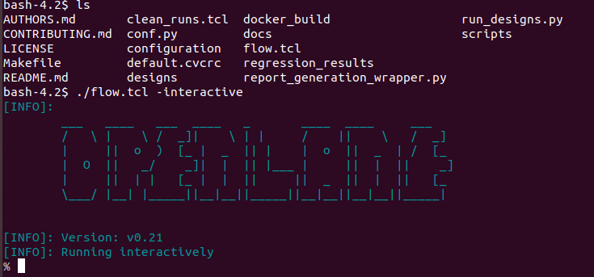
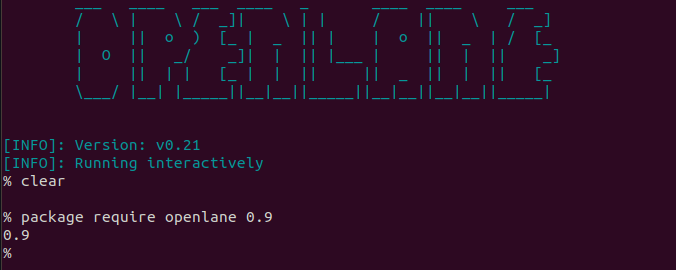
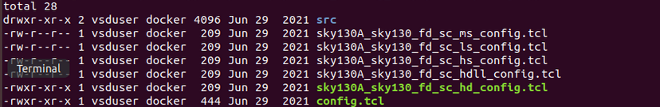
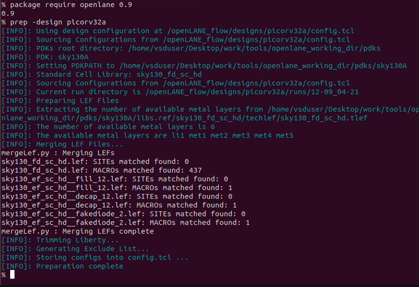

# physical-design-exploration
In this repo I explore opensource EDA tools and PD of ASIC design flow.

# Advanced Physical Design using OpenLANE/Sky130 

## IC Package 


The most critical component of the IC is the ```chip``` because it contains the actual functionality of the device and IO pads helps in exchange of signals with the chip.

## CHIP


A chip usually consists of different components such as macros, IO Pads and pins, Foundary IPs etc.

1. **Macros:** Macros in VLSI design are predefined and reusable blocks of digital circuitry, often standard cells, used to simplify the design process by providing building blocks for complex integrated circuits.

2. **Foundry IPs (Intellectual Property):** Foundry IPs are pre-designed and verified circuit components, such as analog blocks, memory cores, or standard interfaces, licensed from semiconductor foundries for integration into custom chip designs.

3. **IO Pads and IO Pins:** IO pads are the physical interfaces between a chip and the external world, while IO pins are the electrical connections from these pads to the internal circuitry, facilitating input and output communication in integrated circuits.

## Application Specific Integrated Circuit (ASIC)

To develop an ASIC, We mainly require 3 components
- RTL IPs (github.com, opencores.org, librecores.org)
- PDK data (Qflow, OpenRoad, OpenLane)
- EDA Tools [google+skywater](github.com/google/skywater-pdk)

1. **```RTL```** : It is a level of abstraction in digital design and electronics where a system's behavior is described in terms of registers, logic gates, and the flow of data between them.
2. **```PDK```** : Process Design Kit is a collection of files, libraries, and documentation provided by semiconductor foundries to assist designers in creating integrated circuits (ICs) that are compatible with a specific manufacturing process. PDKs include information on design rules, device models, and technology files required for designing and simulating ICs.
3. **```EDA```** : Electronic Design Automation tools are software tools used for designing and testing electronic systems, including ICs and PCBs.

## RTL2GDSII FLow (simplified)

- ```synthesis```
- ```Floorplanning```
- ```Powerplanning```
- ```Placement```
- ```Clock Tree Synthesis```
- ```Routing```
- ```Signoff```

EDA Tools go through all these steps mentioned to obtain the required Layout file that is required for tapeout and The **GOAL** is to produce a clean GDSII with no human intervention which can be used to harden macros and chips (clean : No LVS, DRC, Timing violatons).

## OpenLane


## OpenLANE Design Stages

OpenLANE flow consists of several stages. By default all flow steps are run in sequence. Each stage may consist of multiple sub-stages. OpenLANE can also be run interactively as shown [here][25].

1. *Synthesis*
    1. `yosys` - Performs RTL synthesis
    2. `abc` - Performs technology mapping
    3. `OpenSTA` - Pefroms static timing analysis on the resulting netlist to generate timing reports
2. *Floorplan and PDN*
    1. `init_fp` - Defines the core area for the macro as well as the rows (used for placement) and the tracks (used for routing)
    2. `ioplacer` - Places the macro input and output ports
    3. `pdn` - Generates the power distribution network
    4. `tapcell` - Inserts welltap and decap cells in the floorplan
3. *Placement*
    1. `RePLace` - Performs global placement
    2. `Resizer` - Performs optional optimizations on the design
    3. `OpenPhySyn` - Performs timing optimizations on the design
    4. `OpenDP` - Perfroms detailed placement to legalize the globally placed components
4. *CTS*
    1. `TritonCTS` - Synthesizes the clock distribution network (the clock tree)
5. *Routing*
    1. `FastRoute` - Performs global routing to generate a guide file for the detailed router
    2. `CU-GR` - Another option for performing global routing.
    3. `TritonRoute` - Performs detailed routing
    4. `SPEF-Extractor` - Performs SPEF extraction
6. *GDSII Generation*
    1. `Magic` - Streams out the final GDSII layout file from the routed def
    2. `Klayout` - Streams out the final GDSII layout file from the routed def as a back-up
7. *Checks*
    1. `Magic` - Performs DRC Checks & Antenna Checks
    2. `Klayout` - Performs DRC Checks
    3. `Netgen` - Performs LVS Checks
    4. `CVC` - Performs Circuit Validity Checks

OpenLane can be operated at 2 different modes ie., Automated flow and Interactive mode.

## To enter the automated flow, use these commands
```
cd OpenLane
make mount
./ flow.tcl -design openlane/<DESIGN_NAME>  -tag <TAG>
```

## To enter the Interactive mode, use these commands 
```
cd OpenLane
make mount
./flow.tcl -interactive 
prep -design <path_to_your_design_folder> -tag <tag> -overwrite //overwrite is optional
```

**Interactive mode** offers us to learn all the steps present in automated flow step by step.
The steps are as follows : 

```
run_synthesis
run_floorplan
run_placement
run_cts
run_routing
write_powered_verilog followed by set_netlist $::env(lvs_result_file_tag).powered.v
run_magic
run_magic_spice_export
run_magic_drc
run_lvs
run_antenna_check
```

# COURSE
## DAY 1
Invoking openlane:
```shell
./flow.tcl -interactive
``` 


```shell
package require openlane 0.9
```


```shell
cd designs/picorv32a
ls -ltr
```


> I have used tcl config one can choose to use the more later JSON format



Make sure you are still in interactive mode, to run synthesis use the command synthesis.
*yosys takes over*
```
synthesis
```